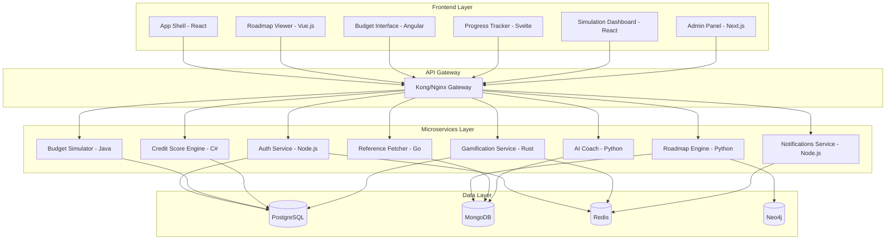

# Design Document

## Overview

FinEdify is designed as a distributed, microservices-based platform that leverages AI for personalized financial education. The architecture emphasizes modularity, scalability, and educational value through the use of different programming languages and frameworks across services. The platform combines AI-generated content with interactive simulations and gamification to create an engaging learning experience.

## Architecture

### High-Level Architecture



### Service Communication

Services communicate through:
- **Synchronous**: REST APIs for real-time operations
- **Asynchronous**: Message queues (RabbitMQ/Apache Kafka) for event-driven operations
- **Real-time**: WebSocket connections for live updates

## Components and Interfaces

### Frontend Components (Micro Frontends)

#### App Shell (React + TypeScript)
- **Purpose**: Main application routing, authentication, and layout
- **Key Features**:
  - Module federation for loading other micro frontends
  - Global state management for user authentication
  - Responsive navigation and layout system
- **APIs**: Authentication, user profile management

#### Roadmap Viewer (Vue.js 3 + Composition API)
- **Purpose**: Display personalized learning paths and progress
- **Key Features**:
  - Interactive roadmap visualization
  - Progress tracking with visual indicators
  - Resource linking and content preview
- **APIs**: Roadmap Engine, Progress tracking

#### Budget Interface (Angular 17 + RxJS)
- **Purpose**: Interactive budgeting tools and financial calculators
- **Key Features**:
  - Real-time budget calculations
  - Category-based expense tracking
  - Visual budget breakdowns and charts
- **APIs**: Budget Simulator, user data persistence

#### Progress Tracker (Svelte + SvelteKit)
- **Purpose**: Gamification elements and achievement tracking
- **Key Features**:
  - XP and level progression displays
  - Badge and achievement galleries
  - Leaderboard and streak tracking
- **APIs**: Gamification Service, user statistics

#### Simulation Dashboard (React + D3.js)
- **Purpose**: Financial simulation tools and interactive scenarios
- **Key Features**:
  - Credit score simulation interface
  - Investment scenario modeling
  - Risk assessment tools
- **APIs**: Credit Score Engine, simulation services

#### Admin Panel (Next.js + Tailwind CSS)
- **Purpose**: Educator and administrator management interface
- **Key Features**:
  - Student progress monitoring
  - Classroom management tools
  - Analytics and reporting dashboards
- **APIs**: All services for administrative access

### Backend Services

#### Auth Service (Node.js + Express + JWT)
- **Purpose**: User authentication, authorization, and profile management
- **Key Features**:
  - JWT-based authentication
  - Role-based access control (Student, Educator, Admin)
  - User profile management
  - Session management with Redis
- **Database**: PostgreSQL (user data), Redis (sessions)
- **APIs**: 
  - `POST /auth/register` - User registration
  - `POST /auth/login` - User authentication
  - `GET /auth/profile` - User profile retrieval
  - `PUT /auth/profile` - Profile updates

#### Roadmap Engine (Python + FastAPI + OpenAI)
- **Purpose**: AI-powered learning path generation and management
- **Key Features**:
  - GPT integration for personalized roadmap creation
  - Learning path optimization based on user progress
  - Content curation and resource recommendation
- **Database**: MongoDB (roadmap content), Neo4j (learning relationships)
- **APIs**:
  - `POST /roadmap/generate` - Create personalized roadmap
  - `GET /roadmap/{userId}` - Retrieve user roadmap
  - `PUT /roadmap/{userId}/progress` - Update learning progress

#### Reference Fetcher (Go + Gin + Web Scraping)
- **Purpose**: Curate and manage educational resource references
- **Key Features**:
  - Web scraping for book and article metadata
  - YouTube API integration for video content
  - Resource quality scoring and filtering
- **Database**: MongoDB (resource metadata)
- **APIs**:
  - `GET /references/search` - Search educational resources
  - `POST /references/curate` - Add new resource references
  - `GET /references/topic/{topic}` - Topic-specific resources

#### Budget Simulator (Java + Spring Boot + JPA)
- **Purpose**: Interactive budgeting tools and financial calculations
- **Key Features**:
  - Real-time budget calculations
  - Scenario modeling and projections
  - Expense categorization and analysis
- **Database**: PostgreSQL (budget data, user simulations)
- **APIs**:
  - `POST /budget/create` - Create new budget simulation
  - `PUT /budget/{id}/update` - Update budget parameters
  - `GET /budget/{userId}/history` - Budget simulation history

#### Credit Score Engine (C# + .NET Core + Entity Framework)
- **Purpose**: Credit score simulation and education
- **Key Features**:
  - Credit score calculation algorithms
  - Factor impact simulation
  - Educational credit scenarios
- **Database**: PostgreSQL (credit simulation data)
- **APIs**:
  - `POST /credit/simulate` - Run credit score simulation
  - `GET /credit/factors` - Credit score factor explanations
  - `POST /credit/scenario` - Create credit scenario

#### AI Coach (Python + FastAPI + OpenAI + LangChain)
- **Purpose**: Personalized AI coaching and feedback system
- **Key Features**:
  - Context-aware coaching responses
  - Learning progress analysis
  - Personalized tip generation
- **Database**: MongoDB (conversation history, coaching data)
- **APIs**:
  - `POST /coach/feedback` - Get AI coaching feedback
  - `POST /coach/question` - Ask coaching questions
  - `GET /coach/tips/{userId}` - Personalized tips

#### Gamification Service (Rust + Actix-web + Diesel)
- **Purpose**: XP tracking, achievements, and leaderboard management
- **Key Features**:
  - XP calculation and level progression
  - Achievement system with badge management
  - Leaderboard generation and ranking
- **Database**: PostgreSQL (user stats), Redis (leaderboard cache)
- **APIs**:
  - `POST /gamification/xp` - Award XP points
  - `GET /gamification/achievements/{userId}` - User achievements
  - `GET /gamification/leaderboard` - Global leaderboard

#### Notifications Service (Node.js + Express + Socket.io)
- **Purpose**: Real-time notifications and communication
- **Key Features**:
  - Real-time push notifications
  - Email notification system
  - Learning reminders and streak alerts
- **Database**: Redis (notification queue)
- **APIs**:
  - `POST /notifications/send` - Send notification
  - `GET /notifications/{userId}` - User notifications
  - WebSocket endpoints for real-time updates

## Data Models

### User Management (PostgreSQL)

```sql
-- Users table
CREATE TABLE users (
    id UUID PRIMARY KEY DEFAULT gen_random_uuid(),
    email VARCHAR(255) UNIQUE NOT NULL,
    password_hash VARCHAR(255) NOT NULL,
    role VARCHAR(50) NOT NULL DEFAULT 'student',
    age_group VARCHAR(20),
    experience_level VARCHAR(20),
    region VARCHAR(100),
    created_at TIMESTAMP DEFAULT CURRENT_TIMESTAMP,
    updated_at TIMESTAMP DEFAULT CURRENT_TIMESTAMP
);

-- User profiles
CREATE TABLE user_profiles (
    user_id UUID PRIMARY KEY REFERENCES users(id),
    first_name VARCHAR(100),
    last_name VARCHAR(100),
    financial_goals TEXT[],
    preferred_learning_style VARCHAR(50),
    timezone VARCHAR(50),
    language VARCHAR(10) DEFAULT 'en'
);

-- Gamification data
CREATE TABLE user_stats (
    user_id UUID PRIMARY KEY REFERENCES users(id),
    total_xp INTEGER DEFAULT 0,
    current_level INTEGER DEFAULT 1,
    learning_streak INTEGER DEFAULT 0,
    last_activity_date DATE,
    badges_earned TEXT[]
);
```

### Learning Content (MongoDB)

```javascript
// Roadmap document structure
{
  _id: ObjectId,
  userId: String,
  title: String,
  description: String,
  difficulty: String, // beginner, intermediate, advanced
  estimatedDuration: Number, // in hours
  modules: [
    {
      id: String,
      title: String,
      description: String,
      order: Number,
      status: String, // not_started, in_progress, completed
      resources: [
        {
          type: String, // book, article, video, tool
          title: String,
          url: String,
          description: String,
          estimatedTime: Number
        }
      ],
      xpReward: Number
    }
  ],
  createdAt: Date,
  updatedAt: Date
}

// Resource references
{
  _id: ObjectId,
  title: String,
  type: String, // book, article, video, podcast
  url: String,
  description: String,
  topics: [String],
  difficulty: String,
  rating: Number,
  source: String,
  metadata: {
    author: String,
    publishDate: Date,
    duration: Number, // for videos/podcasts
    pageCount: Number // for books
  }
}
```

### Learning Relationships (Neo4j)

```cypher
// Node types
CREATE (u:User {id: $userId, name: $name})
CREATE (s:Skill {name: $skillName, category: $category})
CREATE (m:Module {id: $moduleId, title: $title})
CREATE (t:Topic {name: $topicName})

// Relationship types
CREATE (u)-[:HAS_SKILL {level: $level, acquiredAt: $date}]->(s)
CREATE (m)-[:TEACHES]->(s)
CREATE (s)-[:PREREQUISITE_FOR]->(s2)
CREATE (m)-[:COVERS]->(t)
CREATE (u)-[:COMPLETED {completedAt: $date, score: $score}]->(m)
```

## Error Handling

### Service-Level Error Handling

1. **Circuit Breaker Pattern**: Implement circuit breakers for external API calls (OpenAI, YouTube API)
2. **Retry Logic**: Exponential backoff for transient failures
3. **Graceful Degradation**: Continue operation with reduced functionality when services are unavailable
4. **Error Logging**: Centralized logging with correlation IDs for request tracing

### Frontend Error Handling

1. **Error Boundaries**: React error boundaries to catch and display user-friendly error messages
2. **Offline Support**: Service workers for caching critical functionality
3. **Loading States**: Clear loading indicators and skeleton screens
4. **Validation**: Client-side validation with server-side verification

### Data Consistency

1. **Event Sourcing**: Track all user actions as events for audit and recovery
2. **Saga Pattern**: Manage distributed transactions across services
3. **Eventual Consistency**: Accept temporary inconsistency for better performance
4. **Conflict Resolution**: Handle concurrent updates with last-writer-wins or merge strategies

## Testing Strategy

### Unit Testing
- **Frontend**: Jest + React Testing Library, Vue Test Utils, Angular Testing, Vitest for Svelte
- **Backend**: Language-specific frameworks (Jest for Node.js, pytest for Python, JUnit for Java, xUnit for C#, cargo test for Rust)
- **Coverage Target**: 80% code coverage minimum

### Integration Testing
- **API Testing**: Postman/Newman for automated API testing
- **Database Testing**: Test containers for isolated database testing
- **Service Communication**: Contract testing with Pact

### End-to-End Testing
- **Browser Testing**: Playwright for cross-browser testing
- **User Journey Testing**: Critical path testing for key user flows
- **Performance Testing**: Load testing with k6 or Artillery

### Testing Infrastructure
- **CI/CD Pipeline**: GitHub Actions with automated testing on pull requests
- **Test Environments**: Separate staging environment mirroring production
- **Monitoring**: Application performance monitoring with error tracking

## Security Considerations

### Authentication & Authorization
- JWT tokens with short expiration times
- Refresh token rotation
- Role-based access control (RBAC)
- Multi-factor authentication for admin accounts

### Data Protection
- Encryption at rest and in transit
- PII data anonymization in logs
- GDPR compliance for user data
- Regular security audits and penetration testing

### API Security
- Rate limiting to prevent abuse
- Input validation and sanitization
- CORS configuration
- API versioning and deprecation strategies

## Performance Optimization

### Frontend Performance
- Code splitting and lazy loading
- CDN for static assets
- Image optimization and lazy loading
- Bundle size monitoring

### Backend Performance
- Database query optimization
- Caching strategies (Redis for session data, application cache)
- Connection pooling
- Horizontal scaling with load balancers

### Monitoring & Observability
- Application metrics with Prometheus
- Distributed tracing with Jaeger
- Log aggregation with ELK stack
- Real-time alerting for critical issues